# Fishkey

## Table of contents
* [General info](#general-info)
* [Technologies](#technologies)
* [Demo](#demo)
* [Features](#features)
* [Screenshots](#screenshots)

## General info
**Fishkey** is a simple app for learning new concepts using five boxes flashcard method. Flashcard is a small card with question on obverse and answer on reverse. Flip the card to get the correct answer. The aim of the method is to train each flashcard five times stepping by all box stages. Using app you can create your own flashacards assigning them to categories. Every new flashcard goes to the first box. After clicking correct or wrong button app will count the new flashcard stage and put it in suitable box. Train your brain and become a real flashcards master!

## Technologies
**Frontend:** React, JavaScript, TypeScript, SCSS\
**Backend:** Firebase

## Demo
https://fishkey-1f7b9.web.app/

Create new user or login with test credentials: \
**LOGIN:** test@test.com \
**PASSWORD:** qwe123

## Features
* Login/Register
* Create new flashcard
* Browse categories
* Browse flashcards within specific category
* Check flashcards count in each box
* Flip flashcard to get the correct answer
* Use correct/wrong button to change flashcard stage
* Delete flashcard

## Screenshots
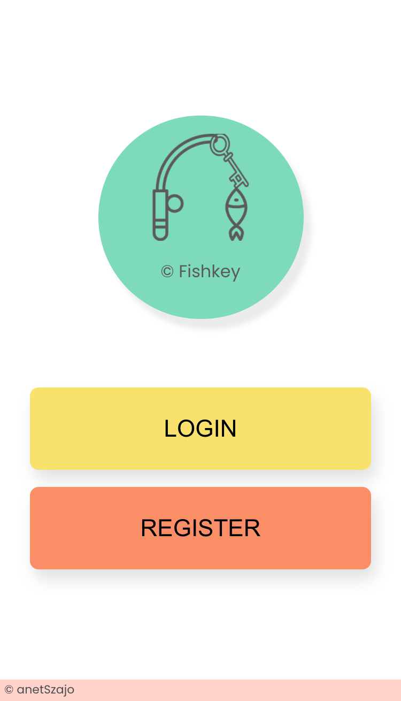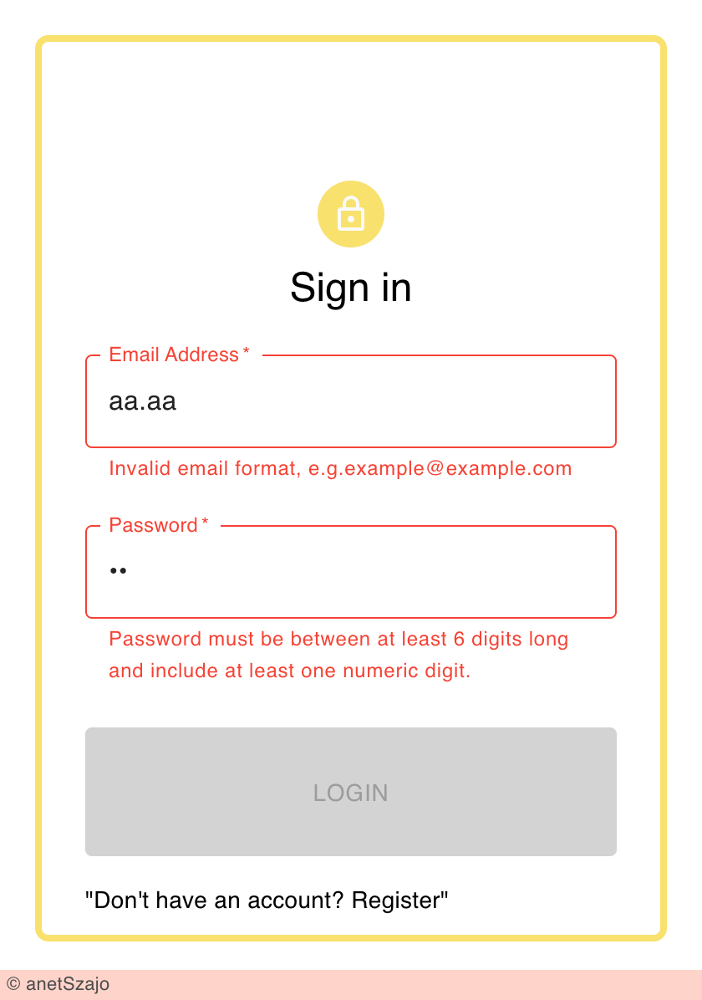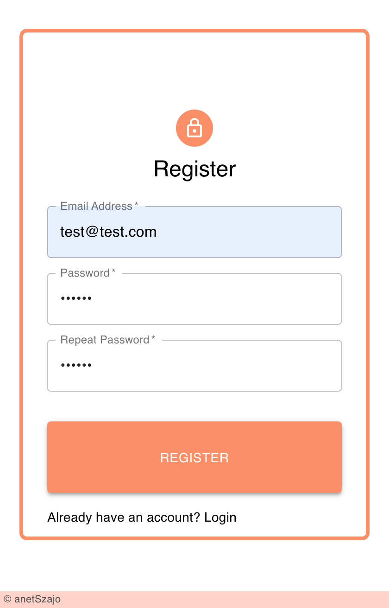
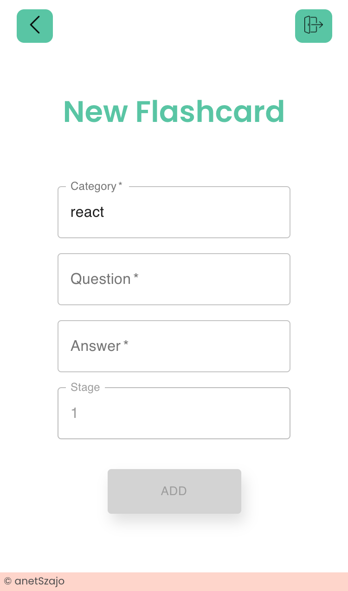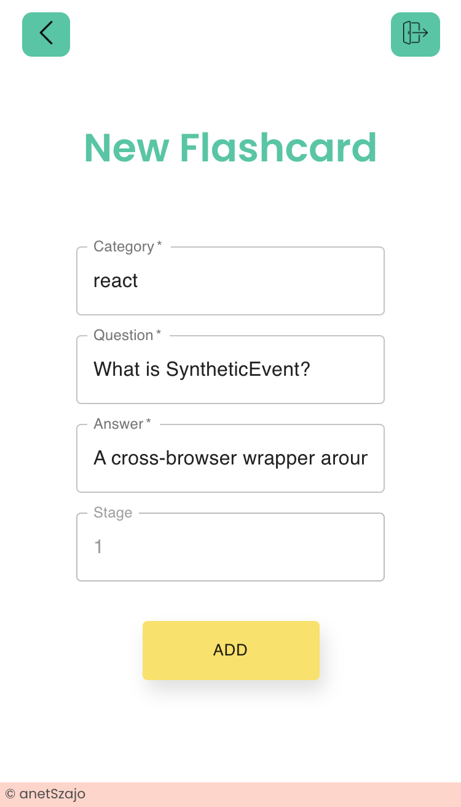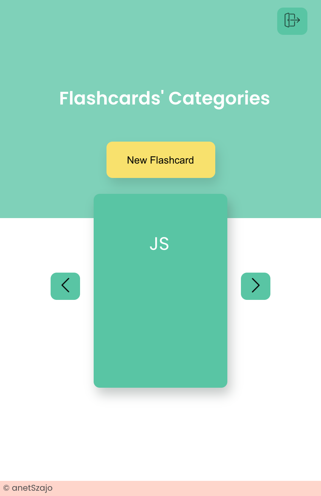
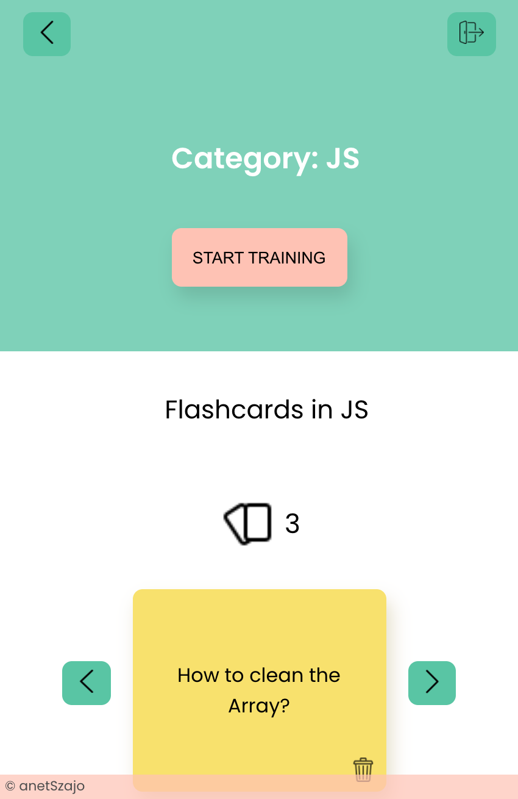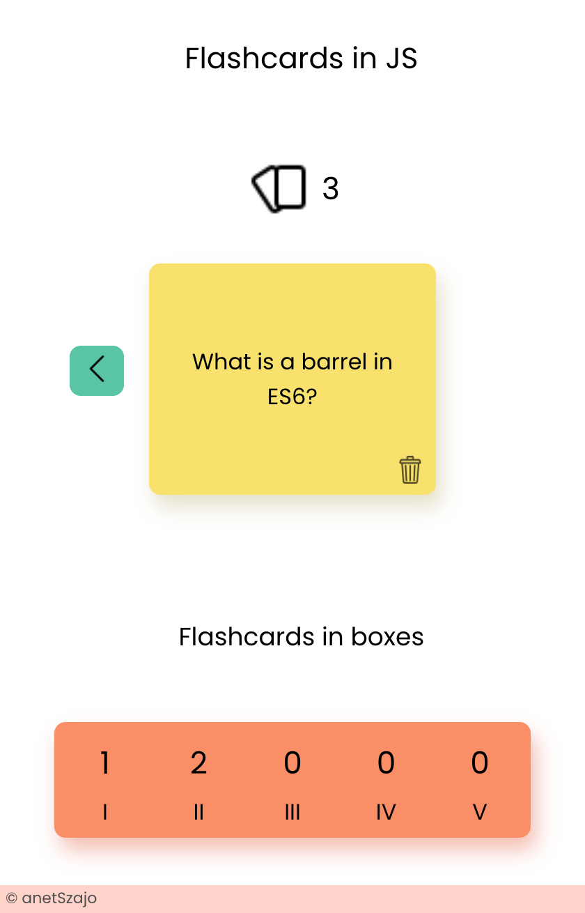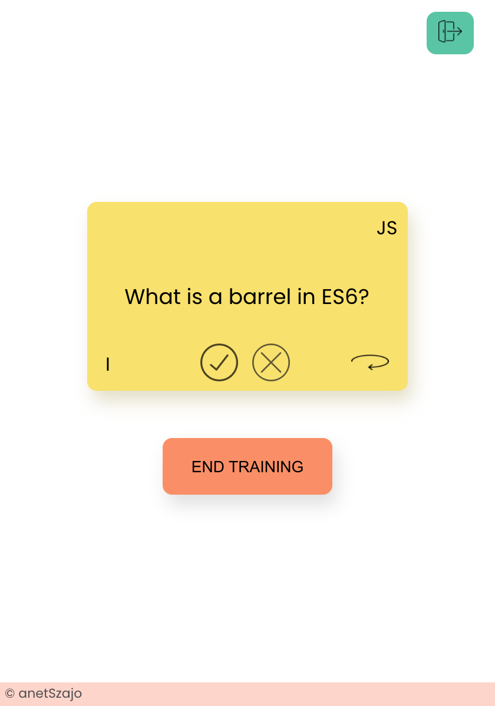
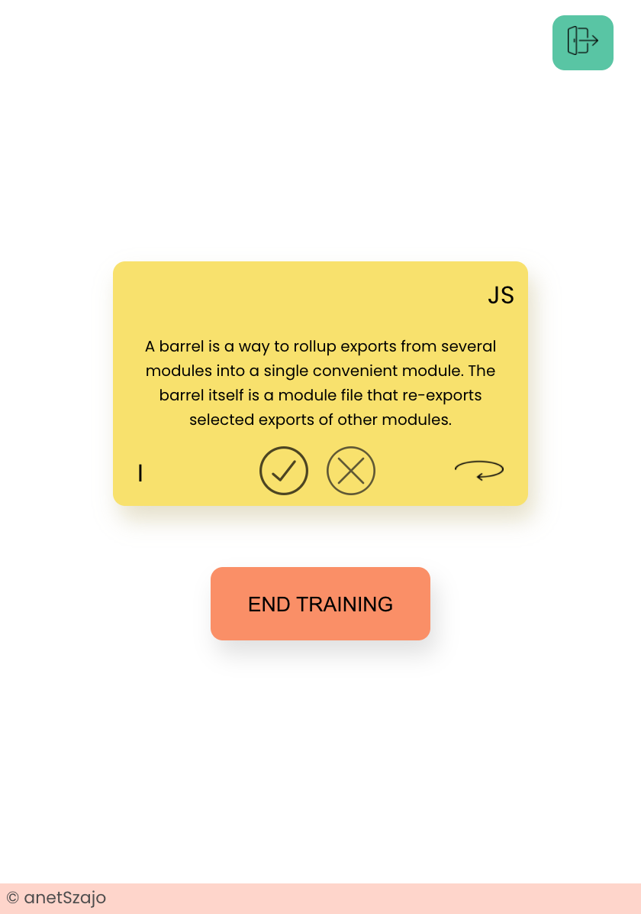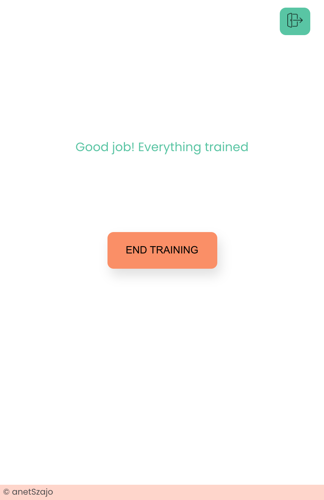
